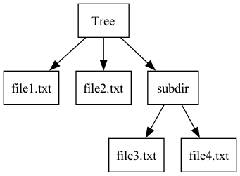

# Tree Structure

## Description

Tree Structure is a Python tool that allows you to visualize the structure of a directory as a tree. It displays the tree in the terminal, saves the structure as a JSON file, and generates a PNG image representing the tree.

## Features

- Displays the directory tree in the terminal.
- Saves the tree structure as a JSON file.
- Generates a PNG image of the tree.
- Options to show hidden files/directories and limit the depth of exploration.

## Usage

### Prerequisites

- Python 3.x
- Python libraries: `os`, `argparse`, `json`, `pydot`

### Installation

1. Clone the repository:
   ```sh
   git clone https://github.com/melvinbarbaux/Arborescence.git
   cd Arborescence
   ```

2. Install the dependencies:
   ```sh
   pip install pydot
   ```

### Commands

To display the tree of a directory, run:
```sh
python main.py /path/to/directory
```

Additional options:
- `--show-hidden`: Show hidden files and directories.
- `--max-depth`: Limit the depth of exploration.

Example:
```sh
python main.py /path/to/directory --show-hidden --max-depth 3
```

## Example Output

### Tree in the Terminal

```
📁 Directory Tree: /path/to/directory

├── file1.txt
├── file2.txt
└── subdir
    ├── file3.txt
    └── file4.txt
```

### JSON File

```json
{
    "file1.txt": null,
    "file2.txt": null,
    "subdir": {
        "file3.txt": null,
        "file4.txt": null
    }
}
```

### PNG Image



## Contributing

Contributions are welcome! Please submit a pull request or open an issue to discuss the changes you wish to make.

## License

This project is licensed under the MIT License. See the [LICENSE](LICENSE) file for details.
